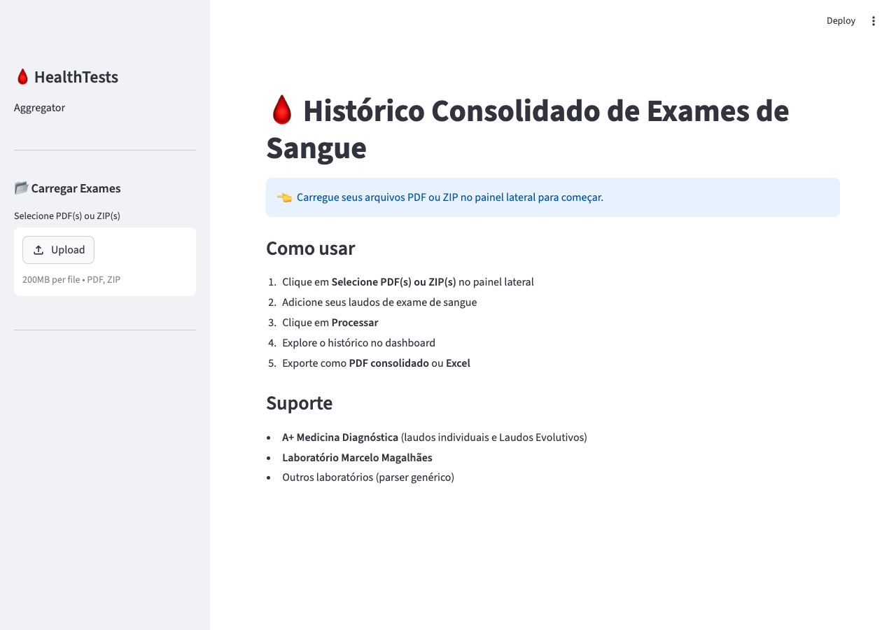
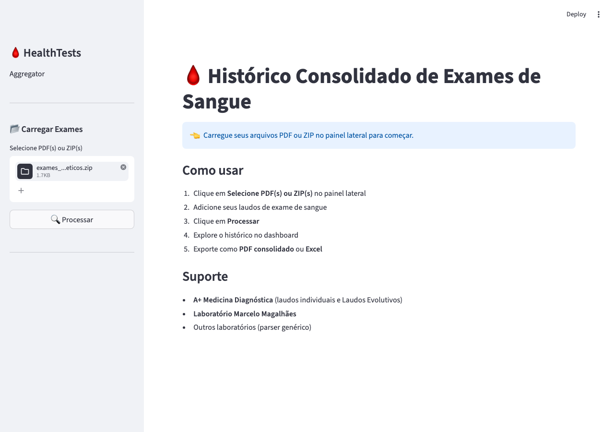
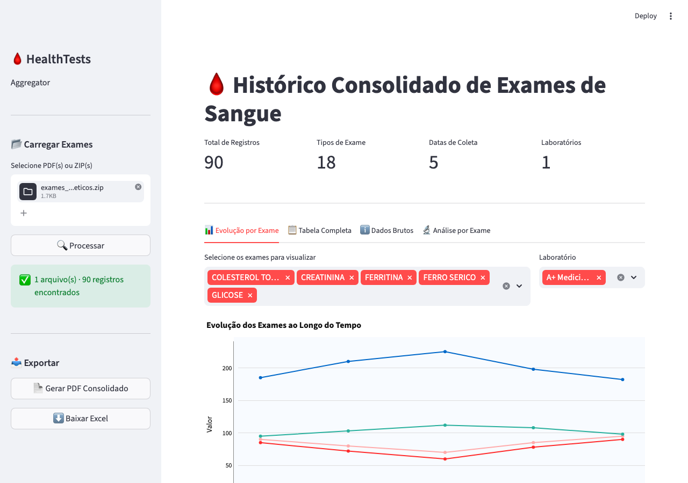
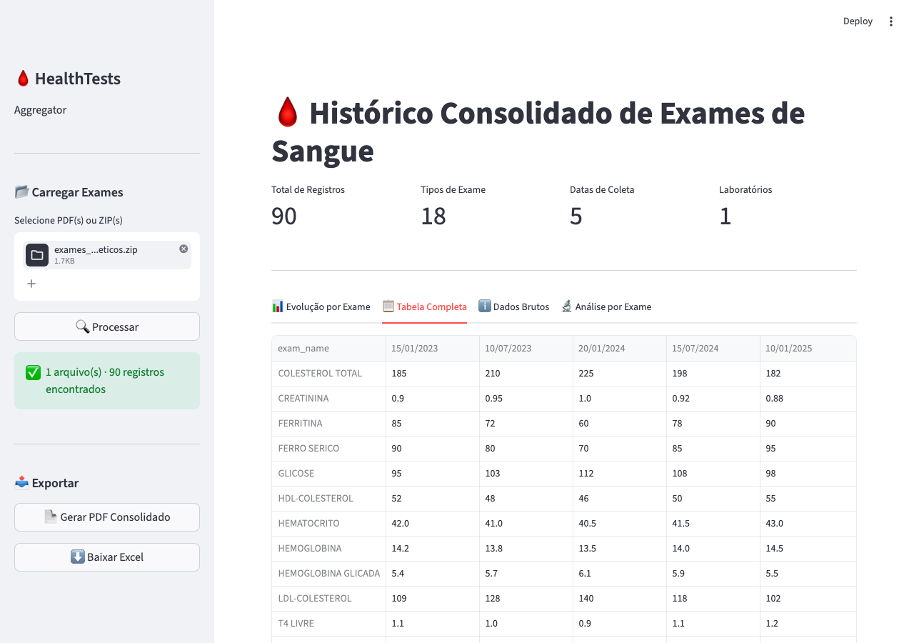
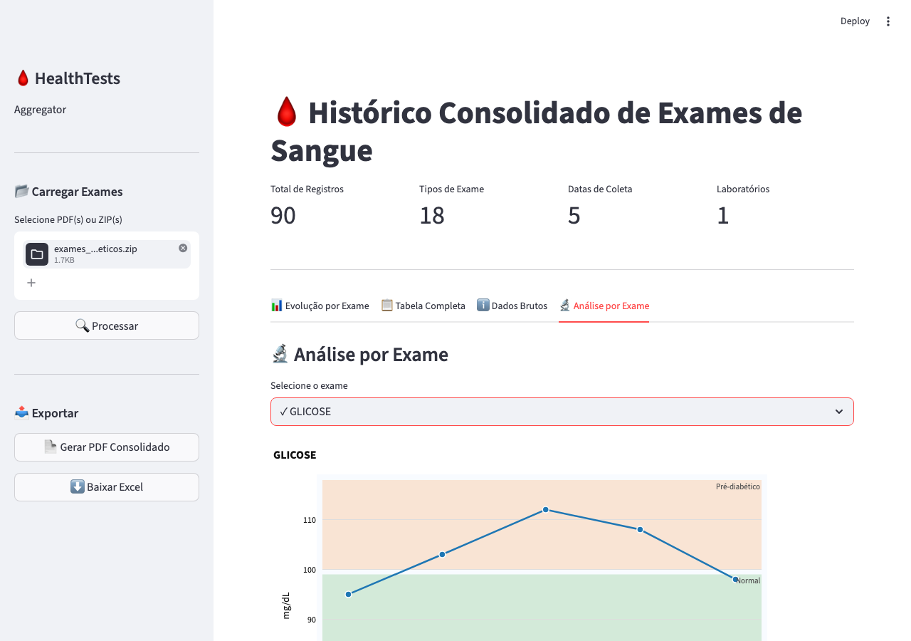
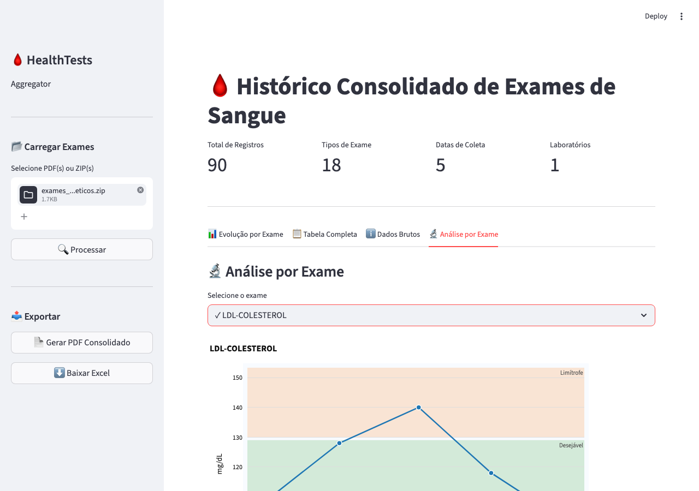

# HealthTests Aggregator

Ferramenta CLI e dashboard interativo para consolidar e visualizar histórico de exames de sangue a partir de PDFs de laboratório.

## Funcionalidades

- **Parsing automático** de PDFs de múltiplos laboratórios brasileiros
- **Consolidação** de resultados em DataFrame unificado com deduplicação
- **Valores de referência configuráveis** por tipo de exame, com suporte a faixas coloridas (zonas clínicas)
- **Exportação** para PDF formatado e planilha Excel (tabela pivô)
- **Dashboard interativo** (Streamlit + Plotly) com aba de análise por exame, barra de progresso e filtros
- Suporte a arquivos `.zip` contendo múltiplos PDFs

## Laboratórios suportados

| Laboratório | Formatos |
|---|---|
| A+ Medicina Diagnóstica | Laudo Evolutivo (tabela multi-data), laudos individuais por exame |
| Laboratório Marcelo Magalhães | Laudos individuais por exame |
| Hemograma tabular | Formato `NOME_EXAME : VALOR UNIDADE REF` |

## Instalação

**Requisitos:** Python 3.10+

```bash
pip install -r requirements.txt
```

### Dependências

| Pacote | Uso |
|---|---|
| `pdfplumber` | Extração de texto de PDFs |
| `pandas` | Manipulação e deduplicação de dados |
| `reportlab` | Geração de relatórios PDF |
| `plotly` | Gráficos interativos |
| `streamlit` | Dashboard web |
| `openpyxl` | Exportação Excel |
| `tqdm` | Barra de progresso no CLI |
| `pyyaml` | Leitura do arquivo de valores de referência |

## Uso

### CLI — Processar exames

```bash
# Processar um arquivo ZIP com PDFs
python main.py process "Exames de Sangue.zip"

# Especificar arquivo de saída
python main.py process "Exames de Sangue.zip" --output output/meu_relatorio.pdf
```

O comando gera dois arquivos em `output/`:
- `historico_exames.pdf` — relatório formatado
- `historico_exames.xlsx` — tabela pivô (exames × datas)

A CLI exibe uma barra de progresso ao processar ZIPs:

```
Processando PDFs:  67%|███████   | 20/30 [00:53<00:26,  2.7s/arquivo, exame_2024.pdf]
```

### Dashboard interativo

```bash
python main.py dashboard
```

Abre o dashboard Streamlit no navegador. Permite:
- Fazer upload de arquivo ZIP ou PDFs individuais
- Acompanhar o progresso do processamento com barra e percentual por arquivo
- Filtrar exames por nome
- Visualizar gráficos de evolução temporal
- Baixar relatório PDF gerado na interface

## Screenshots

### Tela inicial



### Arquivo selecionado — pronto para processar



### Aba Evolução por Exame

Gráfico de linhas multi-exame ao longo do tempo, com filtro por nome e laboratório.



### Aba Tabela Completa

Tabela pivô com todos os exames nas linhas e datas nas colunas.



### Aba Análise por Exame — Glicose (zonas clínicas)

Gráfico individual com faixas coloridas de risco (Normal, Pré-diabético, Diabético).



### Aba Análise por Exame — LDL-Colesterol

Zonas Desejável e Limítrofe sobrepostas ao histórico de medições.



## Estrutura do projeto

```
HealthTestsAggregator/
├── main.py                 # Ponto de entrada CLI
├── update_references.py    # Script interativo de edição de valores de referência
├── requirements.txt
├── config/
│   └── reference_ranges.yaml # Valores de referência por tipo de exame
├── input/                  # Pasta sugerida para arquivos de entrada
├── output/                 # Saídas geradas (PDF, Excel)
└── src/
    ├── models.py           # Dataclasses ExamResult e ParsedDocument
    ├── parser.py           # Extração e parsing de PDFs
    ├── aggregator.py       # Consolidação em DataFrame e tabela pivô
    ├── reference.py        # Loader de valores de referência
    ├── pdf_exporter.py     # Geração de relatório PDF
    └── dashboard.py        # Dashboard Streamlit
```

## Esquema de dados

### `ExamResult`

| Campo | Tipo | Descrição |
|---|---|---|
| `exam_name` | `str` | Nome do exame (normalizado para maiúsculas) |
| `value` | `str` | Valor bruto como string |
| `unit` | `str \| None` | Unidade de medida |
| `reference_range` | `str \| None` | Intervalo de referência |
| `date` | `date` | Data da coleta |
| `lab` | `str` | Nome do laboratório |
| `source_file` | `str` | Nome do arquivo PDF de origem |

### DataFrame consolidado

```
exam_name | date | value_raw | value_numeric | unit | reference_range | lab | source_file
```

Deduplicação: para o mesmo par `(exam_name, date)`, mantém a última ocorrência encontrada.

Normalização do `exam_name`: uppercase, espaços colapsados, hifens Unicode convertidos para `-` ASCII antes da comparação.

## Valores de Referência

Os valores de referência ficam em `config/reference_ranges.yaml`. Cada entrada define:

| Campo | Descrição |
|---|---|
| `unit` | Unidade de medida |
| `aliases` | Nomes alternativos como aparecem nos PDFs |
| `type` | `range` \| `max_only` \| `min_only` \| `qualitative` |
| `min`, `max` | Limites numéricos |
| `note` | Observação (ex: "Masculino", "Em jejum") |
| `zones` | Faixas coloridas para visualização (label, color hex, min, max) |

Para editar interativamente:

```bash
python update_references.py
```

## Testes

```bash
pip install pytest
python -m pytest tests/ -v
```

| Arquivo | Cobre |
|---|---|
| `tests/test_aggregator.py` | Deduplicação com hifens Unicode, dedup case-insensitive, exames distintos não colapsados |
| `tests/test_parser.py` | Leitura de todas as páginas do PDF, processamento de todos os PDFs do ZIP, preservação de múltiplos pontos de dados por exame |
